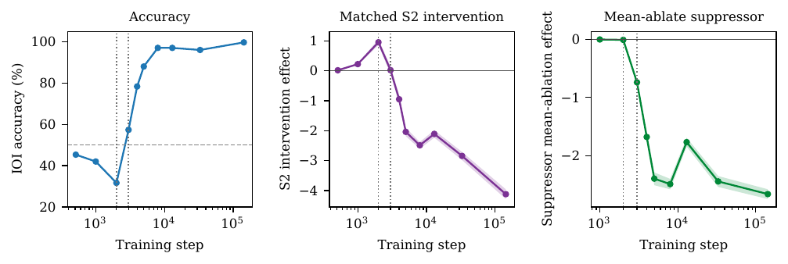
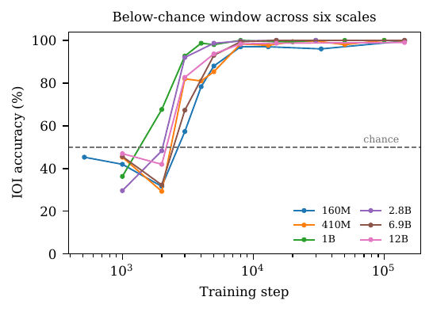
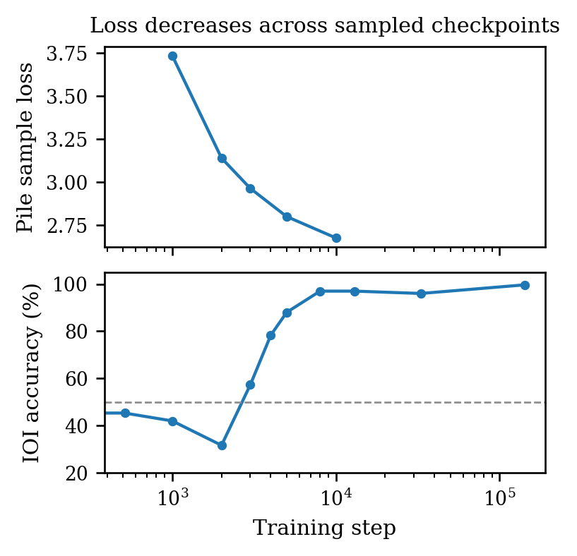

# A Training-Time Sign Flip During the Formation of an Indirect Object Identification Circuit

Mechanistic Interpretability Workshop at ICML 2026

[](paper/sign_flip_ioi_miw2026.pdf)
[](https://huggingface.co/teys7007/pythia-160m-seed42-dense)
[](LICENSE)

<p align="center">
  
</p>

## Overview

This repository contains the public code, result files, figures, and protocol
documentation for **A Training-Time Sign Flip During the Formation of an Indirect Object Identification Circuit**.

We study indirect object identification. In a prompt such as

> When Mary and John went to the store, John gave a drink to ___

the correct continuation is **Mary**, the name mentioned once, rather than
**John**, the repeated name. During training, Pythia models briefly prefer the
repeated name on this two-name comparison.

At each checkpoint, we replace the residual-stream activations at the repeated
name's second mention, S2, with activations from a matched prompt in which that
mention contains a new name. In Pythia-160M, this replacement changes the
IO-minus-S logit difference by **+0.95** at the lowest-accuracy checkpoint and
by **-4.12** at the final checkpoint. The effect of the same replacement
procedure therefore reverses across training.

The reversal appears across all six tested Pythia scales, all nine tested
PolyPythia training variants, and Stanford GPT-2 Small.

## Three measurements

The paper separates three questions:

1. Can a classifier read whether the name at S2 is repeated?
2. Does changing the activations at S2 change the model's prediction?
3. When does a mature repeated-name suppressor begin to help?

These measurements change on different schedules. The held-out probe is only
modestly above chance during the low-accuracy window, the matched-S2
replacement later changes sign, and mature suppressor function becomes strong
during recovery.

<p align="center">
  
</p>

## Main replication table

| Model | Floor accuracy | S2 effect at window | S2 effect at maturity | Patched layers |
|:--|--:|--:|--:|:--|
| Pythia-160M | 31.7% | +0.95 | -4.12 | 3 to 5 |
| Pythia-410M | 29.3% | +0.11 | -3.63 | 6 to 10 |
| Pythia-1B | 36.3% | +0.43 | -3.49 | 4 to 8 |
| Pythia-2.8B | 29.7% | +0.33 | -4.05 | 8 to 14 |
| Pythia-6.9B | 32.3% | +0.84 | -4.12 | 8 to 14 |
| Pythia-12B | 42.0% | +0.43 | -3.96 | 9 to 16 |

For the primary Pythia-160M result, the template-clustered interval is
**[+0.68, +1.25]** at the floor and **[-4.54, -3.72]** at maturity.

## Reproduction scripts

| Analysis | Script |
|---|---|
| Matched-S2 intervention across Pythia scales | `scripts/reproduce_intervention.py` |
| Step-1000 all-head zero-ablation sweep | `scripts/reproduce_head_ablation.py` |
| Position-control battery | `scripts/reproduce_position_controls.py` |
| Locked 800-prompt input-level control | `scripts/reproduce_input_control.py` |
| Held-out and position-shuffle probes | `scripts/reproduce_probes.py` |
| Mature-selected suppressor trajectory and characterization | `scripts/reproduce_suppressor_trajectory.py` |
| Split-safe frozen suppressor-set trajectory | `scripts/reproduce_splitsafe_suppressors.py` |
| Probe-direction removal | `scripts/reproduce_projection_removal.py` |
| Stanford GPT-2 and PolyPythia replications | `scripts/reproduce_replications.py` |
| Full-vocabulary floor analysis and sampled Pile loss | `scripts/reproduce_loss_and_vocabulary.py` |

Protocol details are documented in the paper appendix, script help text, and
committed configuration files.

## Installation

For numerical checks and figure generation:

```bash
python -m pip install numpy matplotlib
```

For model experiments:

```bash
python -m pip install -r requirements.txt
```

Large Pythia models require a CUDA device with sufficient memory. The smaller
Pythia-160M experiments can run on CPU, but are substantially slower.

## Verify the released numbers

```bash
python scripts/verify_claims.py --verbose
```

The verifier checks the numerical values used in the paper, protocol metadata,
figure files, model links, and accidental credential or machine-path leaks.

## Regenerate the figures

```bash
python scripts/make_figures.py
```

<p align="center">
  
</p>

<table>
<tr>
<td width="50%" valign="top" align="center"></td>
<td width="50%" valign="top" align="center"></td>
</tr>
</table>

## Reproduce selected analyses

```bash
python scripts/reproduce_intervention.py --model pythia-160m --step 2000 \
  --output results/pythia-160m_step2000.json --save-per-example
python scripts/reproduce_position_controls.py
python scripts/reproduce_input_control.py
python scripts/reproduce_probes.py
python scripts/reproduce_suppressor_trajectory.py
python scripts/reproduce_splitsafe_suppressors.py
python scripts/reproduce_projection_removal.py
python scripts/reproduce_replications.py --suite all
python scripts/reproduce_loss_and_vocabulary.py --analysis all
```

## Repository structure

```text
.
├── assets/             README visualizations
├── config/             patch windows and frozen-set protocol metadata
├── data/               committed paper-facing result files
├── figures/            paper figures in PDF and PNG formats
├── paper/              compiled workshop paper
├── scripts/
│   ├── lib/            deterministic datasets and shared runtime helpers
│   ├── reproduce_*.py  standalone ICML-facing producers
│   ├── make_figures.py
│   └── verify_claims.py
├── requirements.txt
├── CITATION.cff
└── LICENSE
```

## Scope

This release is intentionally limited to the claims made in the ICML
Mechanistic Interpretability Workshop paper: the training-time S2 sign
reversal, its controls and replications, and the distinct timelines of probe
readability and suppressor function.

## Citation

```bibtex
@inproceedings{dahiya2026signflip,
  title     = {A Training-Time Sign Flip During the Formation of an Indirect Object Identification Circuit},
  author    = {Dahiya, Tejas and Blondin, Cole},
  booktitle = {Mechanistic Interpretability Workshop at the
               43rd International Conference on Machine Learning},
  year      = {2026}
}
```

## License

Code and configuration are released under the MIT License. Data, figures, and
documentation are released under CC BY 4.0. Model checkpoints remain under
their publishers' licenses.
