# A Training-Time Sign Flip in IOI Circuit Formation

Mechanistic Interpretability Workshop at ICML 2026

[](paper/sign_flip_ioi_miw2026.pdf)
[](https://huggingface.co/teys7007/pythia-160m-seed42-dense)
[](LICENSE)

<p align="center">
  
</p>

## Overview

This repository contains the code, result files, figures, and model checkpoint for **A Training-Time Sign Flip in IOI Circuit Formation**.

We study indirect object identification. In a prompt such as

> When Mary and John went to the store, John gave a drink to ___

the correct continuation is **Mary**, the name that appears once, rather than **John**, the repeated name. During training, Pythia models pass through a transient below-chance phase. At the Pythia-160M floor, replacing the residual-stream state at the repeated name's second occurrence, S2, with a matched non-repeating control improves the IO-versus-S logit difference by **+0.95**. At the final checkpoint, the same matched intervention changes it by **-4.12**.

The positive-to-negative reversal appears across all six tested Pythia scales, nine PolyPythias training variants, and Stanford GPT-2 Small.

## Three measurements, three timelines

Linear accessibility, position-level causal dependence, and suppressor function develop on different schedules. The held-out probe is already above chance during the window, the matched-S2 intervention later reverses sign, and robust suppressor function is detected after the below-chance phase.

<p align="center">
  
</p>

## Scale replication

The matched-S2 effect is positive at the floor and negative at maturity for every tested Pythia scale.

<p align="center">
  
</p>

| Model | Floor accuracy | Effect at floor | Effect at maturity | Patched layers |
|:--|--:|--:|--:|:--|
| Pythia-160M | 31.7% | +0.95 | -4.12 | 3 to 5 |
| Pythia-410M | 29.3% | +0.11 | -3.63 | 6 to 10 |
| Pythia-1B | 36.3% | +0.43 | -3.49 | 4 to 8 |
| Pythia-2.8B | 29.7% | +0.33 | -4.05 | 8 to 14 |
| Pythia-6.9B | 32.3% | +0.84 | -4.12 | 8 to 14 |
| Pythia-12B | 42.0% | +0.43 | -3.96 | 9 to 16 |

For the primary Pythia-160M result, the template-clustered interval is **[+0.68, +1.25]** at the floor and **[-4.54, -3.72]** at maturity.

## Additional validation

At step 1000, an early below-chance checkpoint in the single-head sweep, zero-ablating any one attention head changes the mean IO-minus-S logit difference by at most **0.0704** across all 144 heads. This result is stored in [`data/head_zero_ablation_step1000.json`](data/head_zero_ablation_step1000.json) and can be reproduced with [`scripts/reproduce_head_ablation.py`](scripts/reproduce_head_ablation.py).

For the PolyPythias variants, behavioral floors and matched-S2 intervention effects come from separate evaluations. [`data/polypythias_floors.json`](data/polypythias_floors.json) contains the minimum forced-choice accuracies from the 15-family behavioral sweep. [`data/polypythias_signflip_9variants.json`](data/polypythias_signflip_9variants.json) contains the effects from the separate 10-family causal evaluation.

## Paper figures

<p align="center">
  
</p>

<table>
<tr>
<td width="50%" valign="top" align="center"></td>
<td width="50%" valign="top" align="center"></td>
</tr>
</table>

## Installation

For result verification and figure generation:

```bash
python -m pip install numpy matplotlib
```

For model inference:

```bash
python -m pip install -r requirements.txt
```

## Verify the reported results

```bash
python scripts/verify_claims.py --verbose
python scripts/make_figures.py
```

The verification script checks the numerical values used in the paper. The figure script regenerates all three paper figures from the JSON files in `data/`.

## Reproduce the central intervention

```bash
python scripts/reproduce_intervention.py \
  --model pythia-160m \
  --step 2000 \
  --output results/pythia-160m_step2000.json \
  --save-per-example
```

The experiment uses ten BABA-style IOI template families, 30 prompts per template, symmetric name-role swaps, seed 42, checkpoint-local matched controls, and the model-specific residual-stream window in [`config/patch_windows.json`](config/patch_windows.json).

The independently trained Pythia-160M checkpoint used in the split-safe analyses is available at [`teys7007/pythia-160m-seed42-dense`](https://huggingface.co/teys7007/pythia-160m-seed42-dense).

More detailed instructions are available in [`REPRODUCIBILITY.md`](REPRODUCIBILITY.md).

## Repository structure

```text
.
├── assets/             animated README visualizations
├── config/             residual-patch windows
├── data/               result files used by the paper
├── figures/            paper figures in PDF and PNG formats
├── paper/              workshop paper
├── scripts/            verification, plotting, and reproduction code
├── REPRODUCIBILITY.md
├── requirements.txt
├── CITATION.cff
└── LICENSE
```

## Citation

```bibtex
@inproceedings{dahiya2026signflip,
  title     = {A Training-Time Sign Flip in {IOI} Circuit Formation},
  author    = {Dahiya, Tejas and Blondin, Cole},
  booktitle = {Mechanistic Interpretability Workshop at the
               43rd International Conference on Machine Learning},
  year      = {2026}
}
```

## License

Code and configuration are released under the MIT License. Data, figures, and documentation are released under CC BY 4.0. Model checkpoints remain under their publishers' licenses.
